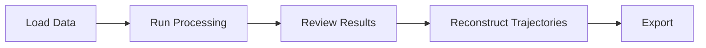

# Quick Start Guide

Process your first SEEG case in 30 minutes.

---

## Overview

The SlicerSEEG workflow consists of four main phases:



---

## Phase 1: Load Your Data

### Required Input

- **Post-operative CT scan** with implanted SEEG electrodes

### Optional Input

- **Pre-operative MRI** for brain mask generation (improves accuracy)

### Loading Data

1. **Drag and drop** your DICOM/NRRD/NIFTI files into Slicer, or
2. Use **File → Add Data** to import volumes

!!! tip "Naming Convention"
    Name your volumes descriptively (e.g., "PostOp_CT", "PreOp_MRI") for easier identification.

---

## Phase 2: Configure and Run Processing

### Open the Module

1. Click the **Module Selector** in the toolbar
2. Navigate to **Segmentation → SEEG ElectrodeLocalization**

### Configure Inputs

| Setting | Selection |
|---------|-----------|
| **MRI Input** | Pre-operative MRI (or existing brain mask) |
| **CT Input** | Post-operative CT with electrodes |
| **Output Folder** | (Optional) Custom name for results |

### Run Processing

1. Click **Apply**
2. Monitor progress in the Python console
3. Wait 15-30 minutes for completion

!!! info "Processing Time"
    - Brain extraction: ~5 minutes
    - Image enhancement: ~10 minutes
    - Confidence analysis: ~5 minutes

---

## Phase 3: Review Results

### Using the Confidence Viewer

After processing completes, the **Confidence Viewer** panel activates:

1. **Threshold Slider**: Adjust to filter electrode candidates
   - Higher = fewer candidates, more confident
   - Lower = more candidates, broader coverage

2. **Statistics Display**: Shows detection metrics in real-time

3. **3D Visualization**: Electrodes appear as colored points

### Recommended Workflow

1. Start with default threshold (0.05)
2. Visually inspect detected electrodes in 3D view
3. Adjust threshold if needed:
   - Too many false positives? → Increase threshold
   - Missing electrodes? → Decrease threshold

---

## Phase 4: Reconstruct Trajectories

The **Manual Trajectory Definition** section allows you to create complete electrode trajectories.

### Select Mode

| Mode | When to Use |
|------|-------------|
| **Semi-Automatic** | Good electrode visibility, uses detected contacts |
| **Manual** | Challenging cases, full user control |

### Create a Trajectory

1. **Enter electrode name** (A, B, C...)
2. **Click "Select Entry Point"** → Click on skull surface in 3D view
3. **Click "Select Deepest Point"** → Click on deepest contact
4. **Adjust spacing** if needed (default: 3.5mm)
5. **Click "Reconstruct Trajectory"**

### Result

- **Markup points** appear for each contact (A1, A2, A3...)
- **Trajectory line** connects all contacts
- **Colors indicate hemisphere**:
  - Blue = Right (R ≥ 0)
  - Pink = Left (R < 0)

### Repeat for All Electrodes

Process each electrode (A, B, C, D, E, F, G...) following the same steps.

---

## Phase 5: Export Results

### Output Location

Results are saved to:
```
~/Documents/SEEG_Results/[your_folder_name]/
```

### Output Files

| Folder | Contents |
|--------|----------|
| `Brain_mask/` | Deep learning brain segmentation |
| `Enhanced_masks/` | 38 enhancement variants |
| `Global_masks/` | Consensus masks (top_mask_1, top_mask_2) |
| `Confidence_Analysis/` | Feature vectors, predictions, summary |

### Exporting Coordinates

To export electrode coordinates:

1. In 3D Slicer, select the `Electrode_*` markup nodes
2. Right-click → **Export to File**
3. Choose CSV or JSON format

---

## Tips for Best Results

### Image Quality

!!! tip "CT Scan Quality"
    - Use high-resolution CT (0.5-1mm slice thickness)
    - Ensure electrodes are clearly visible
    - Avoid motion artifacts

### Processing

!!! tip "Memory Management"
    - Close unnecessary applications
    - For large scans, consider cropping to brain region first

### Trajectory Reconstruction

!!! tip "Accurate Point Selection"
    - Zoom in when selecting entry/deepest points
    - Use orthogonal views for precise placement
    - Enable "Fill Missing Contacts" for better coverage

---

## Example Workflow

```
1. Load PostOp_CT.nrrd
2. Load PreOp_MRI.nrrd (optional)
3. Open SEEG ElectrodeLocalization module
4. Select inputs, click Apply
5. Wait ~20 minutes
6. Adjust confidence threshold to 0.05
7. Create trajectory A: entry → deepest → Reconstruct
8. Create trajectory B: entry → deepest → Reconstruct
9. ... repeat for all electrodes ...
10. Export Electrode_A.mrk.json, Electrode_B.mrk.json, etc.
```

---

## Next Steps

- [Learn about Brain Extraction](../features/brain-extraction.md)
- [Understand Confidence Analysis](../features/confidence.md)
- [Master Trajectory Reconstruction](../features/trajectory.md)
- [View Clinical Validation Results](../validation/clinical-results.md)
